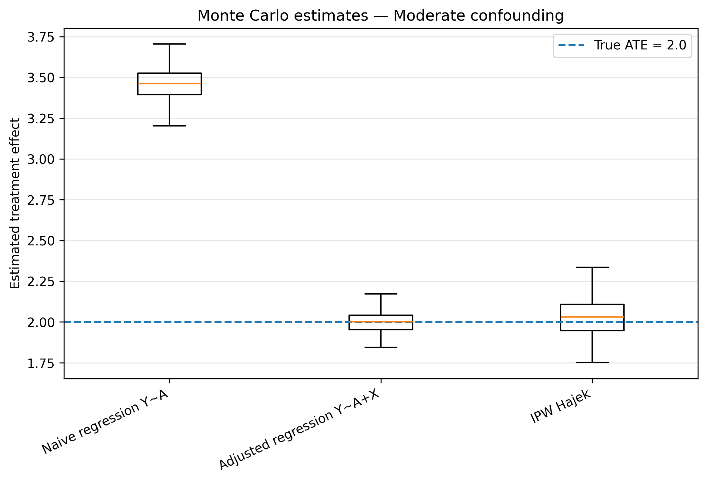
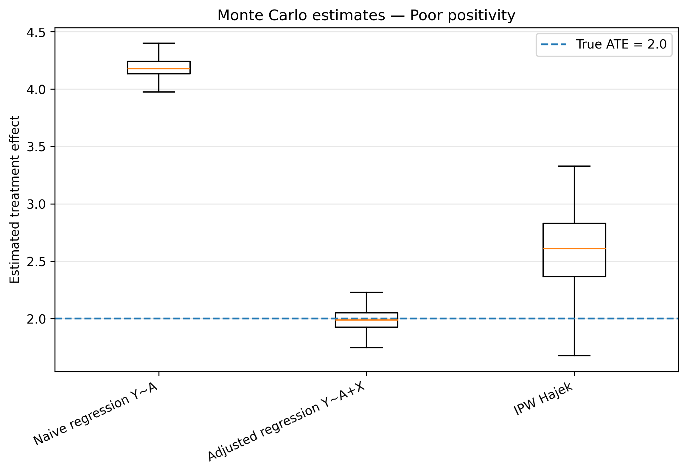

# Causal Inference: Simulation and Estimator Evaluation

Python experiments investigating how confounding and limited overlap affect estimation of an average treatment effect (ATE).

The experiments use **synthetic data with a known treatment effect**, making estimator bias and variability directly measurable. They form an educational computational project in causal inference and statistical simulation.

## Scientific question

When does an observed treatment–outcome association recover a causal effect, and how do regression adjustment and propensity-score weighting behave when their assumptions become difficult to satisfy?

The data-generating model is

$$Y = \beta_0 + \tau A + \gamma X + \varepsilon,$$

where treatment assignment depends on the confounder through a logistic model. The treatment effect is fixed at $\tau = 2$.

## Experiments

| Notebook | Question |
| --- | --- |
| [01 — Confounding bias](01_simulation_confounding_bias.ipynb) | How does ignoring a confounder bias a difference in means or a regression coefficient? |
| [02 — Propensity scores and IPW](02_propensity_score_and_ipw.ipynb) | How do Horvitz–Thompson and Hájek weighting compare with naive and adjusted regression? |
| [03 — Limited overlap](03_positivity_violation.ipynb) | How do extreme weights, effective sample size, trimming and truncation affect estimation? |
| [04 — Monte Carlo evaluation](04_monte_carlo_naive_vs_ipw.ipynb) | How do bias, standard deviation and RMSE vary across three confounding/overlap scenarios? |

## Reproduce the experiments

Use **Python 3.12** for the recorded computation environment.

```bash
git clone https://github.com/Thierrykuatemabap/Causal-Inference-and-Experiments.git
cd Causal-Inference-and-Experiments
python -m venv .venv
source .venv/bin/activate
python -m pip install -r requirements.txt
jupyter notebook
```

Open a notebook, restart its kernel and run all cells in order from the repository directory. Each notebook is self-contained and generates its data locally; no external dataset is required. Figures are written to `figures/`, and the Monte Carlo notebook exports CSV tables to `results/`.

## Recorded results

All four notebooks' Python code cells were executed sequentially in fresh processes on **3 October 2026**. The Monte Carlo experiment uses **300 replications per scenario**, **1,000 observations per replication**, and seeds `1000 + replication`.

| Scenario | Method | Bias | RMSE |
| --- | --- | ---: | ---: |
| No confounding | Naive regression | 0.0009 | 0.1177 |
| No confounding | Adjusted regression | -0.0042 | 0.0677 |
| No confounding | Hájek IPW | -0.0043 | 0.0677 |
| Moderate confounding | Naive regression | 1.4630 | 1.4662 |
| Moderate confounding | Adjusted regression | -0.0023 | 0.0670 |
| Moderate confounding | Hájek IPW | 0.0198 | 0.1317 |
| Poor overlap | Naive regression | 2.1817 | 2.1834 |
| Poor overlap | Adjusted regression | -0.0090 | 0.0946 |
| Poor overlap | Hájek IPW | 0.5088 | 0.7237 |





See [VERIFICATION.md](VERIFICATION.md) for the computation environment and verification scope, and [the complete summary](results/04_monte_carlo_summary.csv) for unrounded results.

## Interpretation and limitations

Ignoring the confounder produces substantial bias. Correctly specified regression adjustment performs well in this linear simulation. Weighting improves estimation with adequate overlap, while limited overlap increases its bias and variability in these finite samples.

The poor-overlap scenario approaches a positivity problem: treatment probabilities remain strictly between zero and one under the logistic model. It illustrates near-violations and practical lack of overlap, rather than a structural zero probability.

These findings depend on the specified simulation model, treatment-effect homogeneity and estimator settings. Trimming changes the analysed population; truncation alters the estimator. Their effects should be assessed explicitly when extending the experiments to observational data.

## Maintainer

[Thierry Kuate Mabap](https://github.com/Thierrykuatemabap) — applied mathematics, scientific computing and data science.
